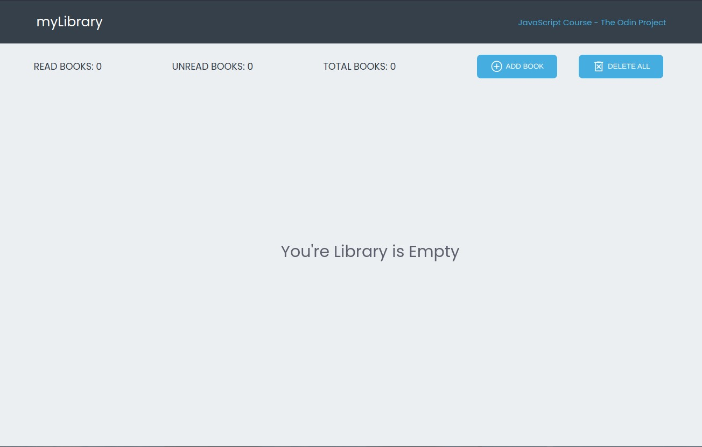
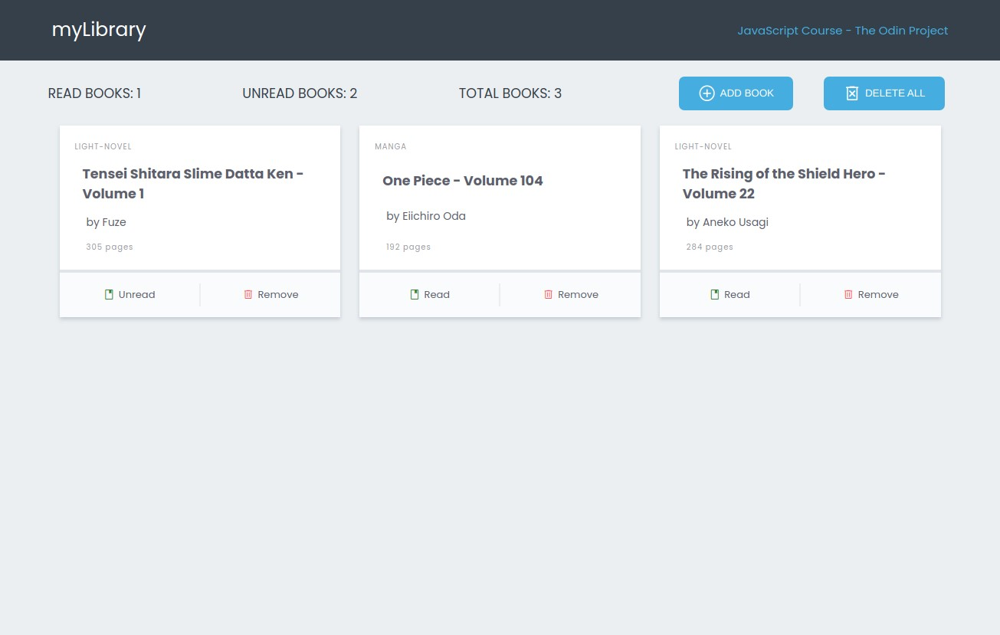

# Library

Let’s extend the ‘Book’ example from the previous lesson and turn it into a small Library app.

## Table of contents

- [Introduction](#introduction)
- [Overview](#overview)
  - [Screenshot](#screenshot)
  - [Built using](#built-using)
  - [Lessons Applied](#lessons-applied)
- [Author](#author)
- [Acknowledgement](#acknowledgement)

## Introduction

- This is my solution to the first project for JavaScript Course.
- This webpage was setup using [Vite](https://vitejs.dev/).
- This library features:
  - Objects and Object Constructors
  - some advance HTML and CSS features
- With added feature:
  - Save and retrieve from local storage

## Overview

- Link: [github.com/kierhb/library](https://github.com/kierhb/library)

### Screenshot

### Built using

- Vanilla JavaScript
- HTML5 markup
- CSS

### Lessons Applied:

- for JavaScript:
  - Objects
  - Object Constructors
- for HTML:
  - Form Basics
- for CSS:
  - CSS Units
  - Online Font Libraries
  - Text Styles
  - Background, Border-radius, Box shadow and Opacity
  - Advance Selectors
  - Positioning
  - CSS Functions
  - Custom Properties
  - CSS Flexbox
  - CSS Grid

## Author

- GitHub - [@kierhb](https://github.com/kierhb)
- LinkedIn - [Kier Bobila](https://www.linkedin.com/in/kier-bobila/)

## Acknowledgement

I want to acknowledge all members of [The Odin Project](https://www.theodinproject.com/) community and also the instructor of [Learn CSS Grid on Scrimba](https://scrimba.com/learn/cssgrid) Mr. Per Borgen.
